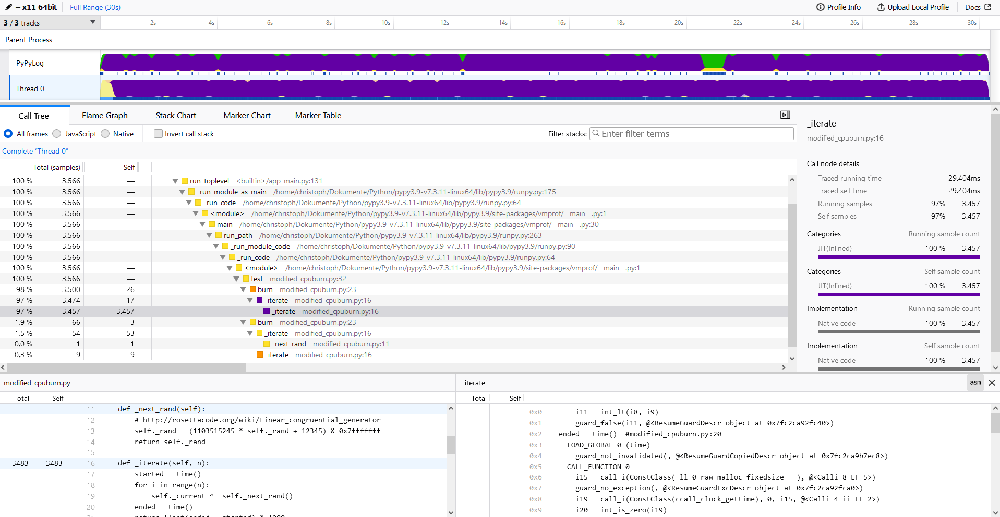

# vmprof-firefox-converter

View vmprof profiles in Firefox Profiler by converting them:

`python -m vmprofconvert -convert profile.prof`

`python -m vmprofconvert -convert profile.zip`

or run vmprof directly:

`python -m vmprofconvert -run yourcode.py <args>`

optional arguments:

`-jitlog <profile.jit>` use jitlog data (only for converting vmprof data)

`--zip` export sharable zip (only for running vmprof)

`--nobrowser` dont open firefox profiler

`--nonative` disable native profiling (only for running vmprof)

`--nolines` disable line profiling (only for running vmprof)

cpuburn code can be found dd
[here](https://github.com/vmprof/vmprof-python/blob/master/vmprof/test/cpuburn.py)

#

- supports CPython and PyPy